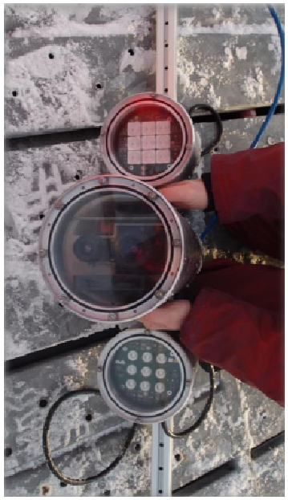

# Fish Industry Aquaculture

<!-- .slide: data-background="img/background-title.png" data-background-opacity="0.2" -->

The aquaculture industry is one of the fastest-growing sectors in the world, driven by increasing demand for sustainable seafood.

Note: Welcome the audience and introduce the topic of aquaculture growth.

---

## My Background: The FishScan Project

  
  

- **Innovation:** Transitioned from manual sampling to **Automated 3D Biomass Estimation**.
- **Sensor Fusion:** Combined **Time-of-Flight (TOF) depth data** with **2D CCD intensity** to solve depth-invariance.
- **Challenges:** Engineered solutions for articulated deformations, viewpoint variations, and underwater occlusions.
- **Impact:** Focused on the critical industry need for precise pre-harvest size distribution (essential for **80% of sales**).

Note: My work involved building a multi-stage pipeline: Fish Detection → Contour Extraction → Volume-Biomass Estimation, utilizing Deformable Part Models (DPM) for aquatic species.

---

## Current State of the Sector

<!-- .slide: data-background="img/background-current-state.png" data-background-opacity="0.2" -->

- Crucial component for sustainable seafood.
- Minimizes environmental impact.
- Faces challenges: disease outbreaks, feed costs, environmental concerns.

Note: Highlight the critical role of aquaculture as an alternative to wild-caught fish.

---

## Companies and Technologies

Summary of leading companies and technologies in the space:

- [**Stingray**](https://www.stingray.no): AI-guided laser sea lice removal and monitoring.
- [**Tidal**](https://www.tidalx.ai): AI-driven feed optimization and underwater robotics.
- [**Aquabyte**](https://www.aquabyte.ai): AI-powered underwater monitoring and analytics.
- [**OptoScale**](https://optoscale.no): Real-time biomass and welfare monitoring via the Bioscope.

Note: These companies represent the forefront of digital transformation in aquaculture.

---

## Stingray

<video data-autoplay loop muted width="100%" height="300px">
  <source src="https://stingrayonline.no/assets/bg-large-DDQn_ZKe.mp4" type="video/mp4">
</video>

<a href="https://www.stingray.no/en/technology/" target="_blank">Discover Stingray Technology</a>

- **Laser Sea Lice Removal:** Identifying parasites in real-time and firing laser pulses to kill them without harming the fish.
- **Real-time AI:** Stereo camera vision identifies parasites in milliseconds.
- **24/7 Monitoring:** Tracks biomass and welfare via Stingray Online.

Note: Stingray takes a direct, active approach to pest control using robotics and lasers, shifting from passive monitoring to active intervention.

---

## Tidal (Alphabet's X)

  

    <video data-autoplay loop muted width="100%" height="auto">
      <source src="https://cdn.prod.website-files.com/66268f7920153766c84384ba/662c17d5b7209e4591a5b1b3_color-fish-trim3-transcode.mp4" type="video/mp4">
    </video>
    <iframe data-src="https://cdn.prod.website-files.com/66268f7920153766c84384ba/662dceab74811b48b7482b9e_fish-detection-without-fish-bg.svg" width="100%" height="200px"></iframe>
  

  

    <ul>
      <li><strong>Autonomous Feeding:</strong> AI-driven optimization to reduce waste.</li>
      <li><strong>Biomass Estimation:</strong> Continuous, real-time growth monitoring.</li>
      <li><strong>Sea Lice Detection:</strong> Automated health tracking.</li>
    </ul>
  

Note: Tidal was incubated at Alphabet's X and focuses on using advanced robotics and AI to reduce the environmental impact of fish farming through optimized feeding.

---

## Aquabyte

  

    <video data-autoplay loop muted width="100%" height="auto">
      <source src="https://rsgjqecbrdknpbviteei.supabase.co/storage/v1/object/public/supabase-payload/media/homepage-new-video.mp4" type="video/mp4">
    </video>
    <a href="https://www.aquabyte.ai/categories/our-solution" target="_blank">Discover Aquabyte Technology</a>
  

  

    
<strong>Product:</strong> Hammerhead Camera & AI Platform

    <ul>
      <li><strong>Technology:</strong> Captures 1M+ images daily, self-cleaning hardware.</li>
      <li><strong>AI Features:</strong> Sea lice counting, biomass estimation, welfare monitoring.</li>
      <li><strong>Hardware:</strong> 
        <ul>
          <li>Hammerhead Camera: Underwater unit.</li>
          <li>Cabinet: Pen-side cloud gateway.</li>
          <li>Winch: Remote repositioning.</li>
        </ul>
      </li>
    </ul>
  

Note: Aquabyte uses hardware-software integration. Their Hammerhead camera connects to cloud ML to provide actionable insights without manual handling. The hardware is designed for extreme underwater conditions with self-cleaning technology.

---

## OptoScale

  

    <video data-autoplay loop muted width="100%" height="auto">
      <source src="https://optoscale.no/wp-content/uploads/2021/08/optoscale_banner_web_v01_1_2.mp4" type="video/mp4">
    </video>
  

  

    
  

<a href="https://optoscale.no/how-it-works/?lang=en" target="_blank">Discover OptoScale Technology</a>

- **Biomass Estimation:** Automating weight and growth tracking.
- **Sea Lice Counting:** Accurately measuring infestation levels.
- **Welfare Assessments:** Monitoring respiration and swimming behavior.

Note: The Bioscope hardware is designed to capture tens of thousands of images daily for comprehensive health tracking without manual handling.

---

## Technologies and Options for Growth

  

    <iframe src="https://ourworldindata.org/grapher/aquaculture-farmed-fish-production?tab=map" loading="lazy" style="width: 100%; height: 500px; border: 0px none;" allow="web-share; clipboard-write"></iframe>
    <small>Source: <a href="https://ourworldindata.org/fish-and-overfishing" target="_blank">Our World in Data</a></small>
  

  

    <ul>
      <li><strong>Role of computer vision:</strong> Addressing challenges of scale and sustainability.</li>
      <li><strong>Innovative solutions:</strong> Driving continued, efficient growth.</li>
      <li><strong>Long-term impact:</strong> Ensuring the viability of the industry.</li>
    </ul>
  

Note: Emphasize that innovation is not just for efficiency but for long-term survival.

---

## Conclusion

<!-- .slide: data-background="img/background-conclusion.png" data-background-opacity="0.2" -->

The fish industry aquaculture sector is at a crossroads where technology like computer vision will be the key to sustainable growth.

Note: Summarize the main points and call for continued innovation.
